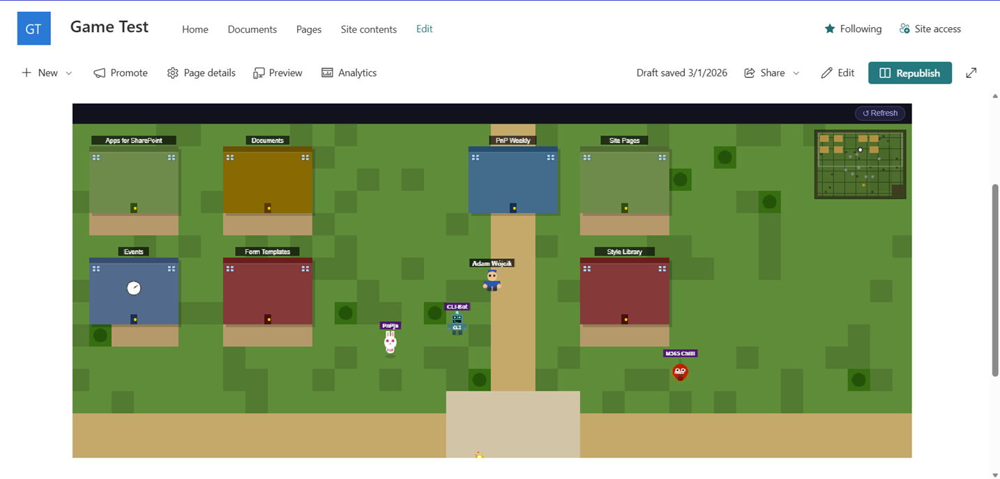

# SPFx SPO Site World

## Summary

This web part creates a 2d game world generated based on the site content and user permissions. The user may explore the list and libraries present on the site and interact with the content in a fun and engaging way. The game also contains users that have access to the site and the user can interact with them to see their profile information. The game also contains some build in easter eggs of PnP known people or initiatives.

## Result

